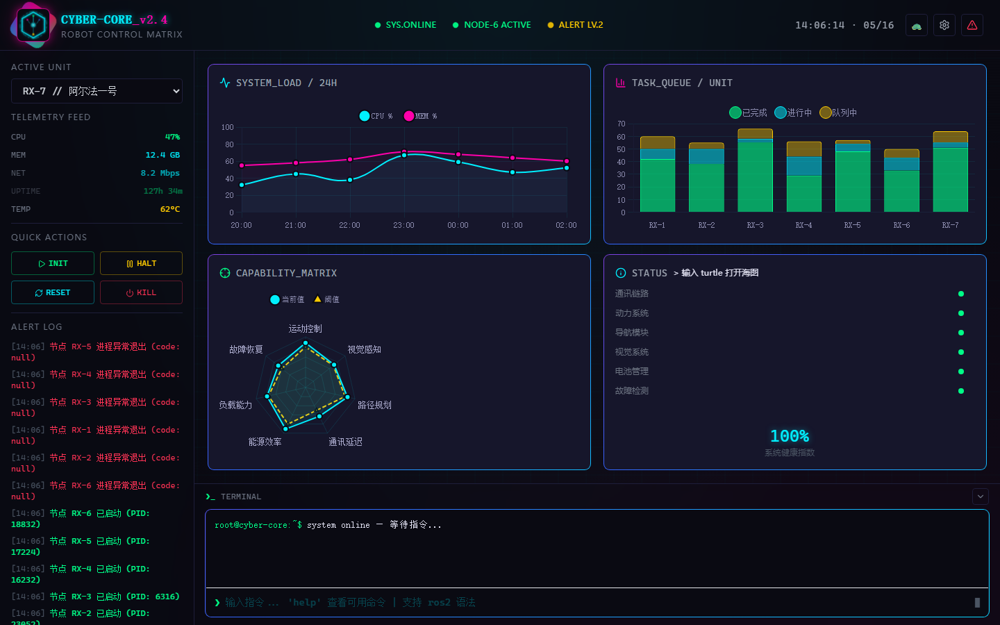

# CYBER-CORE // Robot Control Center

> Cyberpunk industrial robot control dashboard — real process management, live telemetry, Turtle graphics engine.



## What It Does

- **Real Process Management** — spawn, monitor, and kill 18 robot nodes across 3 units via child_process
- **Live Telemetry** — CPU, memory, network stats via `systeminformation`, streamed over WebSocket every 2s
- **Turtle Graphics Engine** — ROS2 turtlesim clone with preset shapes, rainbow pen, mirror mode, keyboard driving
- **Interactive Console** — command terminal with tab completion, 9 REST endpoints, SQLite alert persistence

## Quick Start

```bash
npm install
npm start        # http://localhost:8771
npm run dev      # with --watch
```

## Tech Stack

| Layer | Technology |
|-------|------------|
| Frontend | HTML5, Tailwind CSS CDN, Chart.js 4.x, Lucide Icons |
| Backend | Node.js, Express, ws (WebSocket), sql.js (SQLite WASM) |
| Telemetry | systeminformation |
| Process Manager | child_process (spawn / kill / monitor) |
| UI Themes | Cyber (cyan), Neon (purple), Matrix (green) — CSS variables |

## Architecture

```
index.html ←→ WebSocket / REST ←→ server.js (:8771)
                                    ├── lib/telemetry.js       CPU / MEM / NET
                                    ├── lib/process-manager.js spawn / kill / monitor
                                    ├── lib/config.js          robots.json parser
                                    ├── routes/api.js          9 REST endpoints
                                    ├── routes/ws.js           WebSocket broadcast
                                    ├── db/database.js         SQLite (WASM, zero native deps)
                                    └── scripts/sensor.js      mock HTTP process (replaceable)
```

## REST API

```
GET  /api/status
GET  /api/units
GET  /api/units/:id
GET  /api/units/:id/alerts
GET  /api/processes
POST /api/units/:id/init
POST /api/units/:id/halt
POST /api/units/:id/reset
POST /api/units/:id/kill
```

## WebSocket

`ws://localhost:8771/ws`

Messages: `telemetry` (2s), `alert` (instant), `action_result` (broadcast)

## Turtle Commands

```
F/B/L/R [distance]  — move forward/back/left/right
HL [angle]          — turn heading left
HR [angle]          — turn heading right
PEN UP/DOWN         — pen control
COLOR [hex]         — set pen color
SHAPE [name]        — ♥ ⭐ 🌀 ∞ ⬡ □ ∿ (heart, star, spiral, lemniscate, hexagon, square, sine)
TURTLE HOME         — reset position
CLEAR               — clear canvas
```

Hotkeys: `R` rainbow, `M` mirror, `B` bounce, `WASD/Arrow` drive, `Space` stop, `C` clear

## Graceful Degradation

WebSocket disconnected → falls back to `Math.random()` simulation. Reconnects → resumes real data. Zero UI breakage.

## License

MIT
